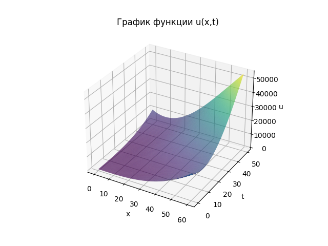
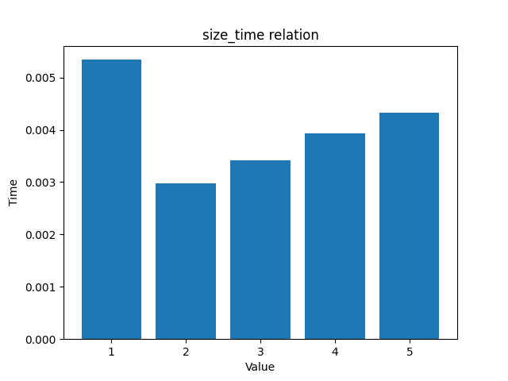
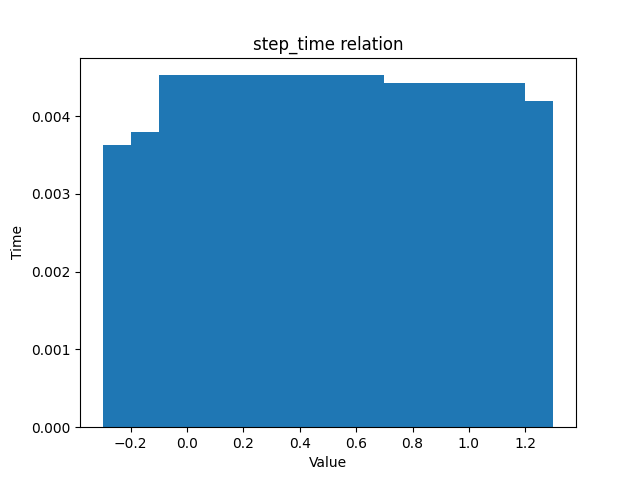
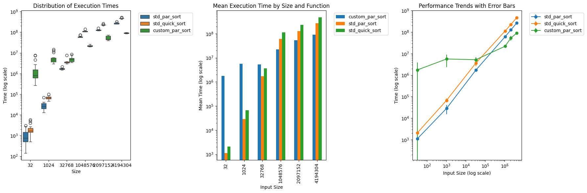

# Parallel Programmings MIPT course

## Quick start

### Build

```bash
sudo apt install mpich libomp-dev
mkdir build && cd build
cmake .. && make -j
```

### Launch

```bash
ctest --versbose
```

## Description

### Configuration

CPU: Intel Core i5 11300H (4 cores, 8 threads)

### Lab1

*Introduction to MPI*

#### Admission

**Task 1**: Calculate pi using MPI

**Results**: 

```bash
Calculated Pi: 3.14159
Actual Pi: 3.14159
Error: 1.11022e-13
```

**Task 2**: Measure time of communication between MPI nodes

**Results**: 

```bash
Message size: 1 KB, Avg time: 2.62737 us, Bandwidth: 743.376 MB/s
Message size: 4 KB, Avg time: 3.94507 us, Bandwidth: 1980.32 MB/s
Message size: 16 KB, Avg time: 12.2503 us, Bandwidth: 2550.97 MB/s
Message size: 64 KB, Avg time: 33.9684 us, Bandwidth: 3679.89 MB/s
Message size: 256 KB, Avg time: 39.7788 us, Bandwidth: 12569.5 MB/s
Message size: 1024 KB, Avg time: 216.363 us, Bandwidth: 9243.74 MB/s
```

#### Task

**Task**: Solve transport equation

**Results**:





### Lab2

*Introduction to POSIX threads, synchronization primitives and processes communication*

#### Admission

**Task**: Write custom parallel sort using threads and compare it with standard quick sort

**Results**:



#### Task

**Task**: Measure communication time between processes (through pipe) and between threads

**Results**:

```bash
Average process communication time is `109953` ns;
Average thread communication time is `32981` ns;
```
