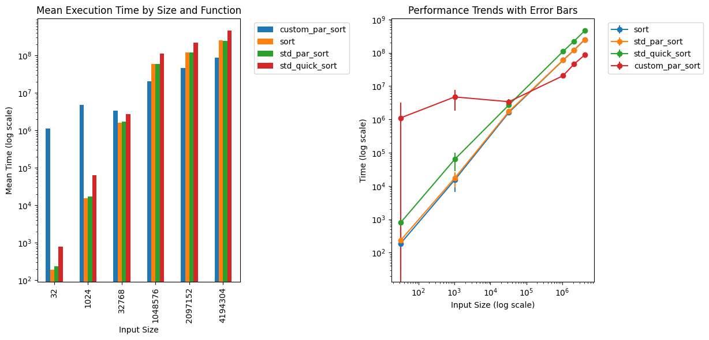

# Курс "Параллельное программирование" (МФТИ)

Курс посвящен введению в параллельные вычисления и многопоточность, состоит из 3 лабораторных работ, каждая из которых подразделяется на допуск и основное задание.

## Конфигурация

*CPU:* Intel Core i5-11300H (4 ядра, 8 потоков)

## 1 работа (Введение в MPI)

### Допуск (1)

#### Задача

Посчитать число пи

#### Запуск

```bash
sudo apt install mpich

mkdir build && cd build
cmake .. && make -j
mpirun -np <count> ./pi_calculation
```

#### Результаты

```
Calculated Pi: 3.14159
Actual Pi: 3.14159
Error: 3.06422e-14
```

### Допуск (2)

#### Задача

Посчитать время коммуникации между узлами в MPI

#### Запуск

```bash
sudo apt install mpich

mkdir build && cd build
cmake .. && make -j
mpirun -np <count> ./communication_time
```

#### Результаты

Для 2 узлов:

```
Message size: 1 KB, Avg time: 2.35943 us, Bandwidth: 827.795 MB/s
Message size: 4 KB, Avg time: 3.82856 us, Bandwidth: 2040.58 MB/s
Message size: 16 KB, Avg time: 10.3665 us, Bandwidth: 3014.5 MB/s
Message size: 64 KB, Avg time: 33.1144 us, Bandwidth: 3774.79 MB/s
Message size: 256 KB, Avg time: 35.478 us, Bandwidth: 14093.2 MB/s
Message size: 1024 KB, Avg time: 189 us, Bandwidth: 10582 MB/s
```

Для 3 узлов:

```
Message size: 1 KB, Avg time: 2.51106 us, Bandwidth: 777.809 MB/s
Message size: 4 KB, Avg time: 3.98675 us, Bandwidth: 1959.62 MB/s
Message size: 16 KB, Avg time: 10.4051 us, Bandwidth: 3003.33 MB/s
Message size: 64 KB, Avg time: 34.3227 us, Bandwidth: 3641.91 MB/s
Message size: 256 KB, Avg time: 37.4353 us, Bandwidth: 13356.4 MB/s
Message size: 1024 KB, Avg time: 184.339 us, Bandwidth: 10849.6 MB/s
```

Для 4 узлов:

```
Message size: 1 KB, Avg time: 3.7344 us, Bandwidth: 523.009 MB/s
Message size: 4 KB, Avg time: 6.46801 us, Bandwidth: 1207.87 MB/s
Message size: 16 KB, Avg time: 12.1808 us, Bandwidth: 2565.52 MB/s
Message size: 64 KB, Avg time: 39.3133 us, Bandwidth: 3179.59 MB/s
Message size: 256 KB, Avg time: 74.2748 us, Bandwidth: 6731.76 MB/s
Message size: 1024 KB, Avg time: 194.688 us, Bandwidth: 10272.8 MB/s
```

### Задание

#### Задача

Решить уравнение переноса

#### Запуск

```bash
sudo apt install mpich

mkdir build && cd build
cmake .. && make -j
python3 ../run.py
python3 ../plot.py
```

#### Результаты

График решения:


Зависимость времени вычисления от количества узлов:


Зависимость времени вычисления от размера сетки:


---

## 2 работа (Процессы и потоки)

### Допуск

#### Задача

Написать параллельный *quick sort* и сравнить со стандартным

#### Запуск

```bash
mkdir build && cd build
cmake .. && make -j
ctest
python3 ../plot.py
```

#### Результаты



### Задание